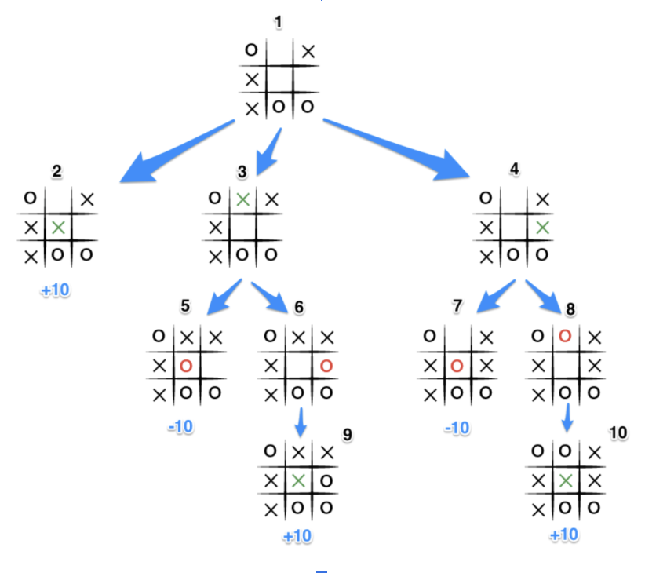

# Report
## A2 - Tic Tac Toe
### Julie Cortis and Julia Curmi

## Introduction
In this project two Tic-Tac-Toe games were implemented. One was done in Python using Functional Programming and one was done in Java using Object Oriented Programming (OOP). For this Tic-Tac-Toe game the user is first prompted to choose from a menu deciding between two game modes: User vs User and User vs AI. If User vs AI is selected, then the user is prompted to choose whether to play in Easy Mode (where the AI move is randomly generated) or Hard Mode (where the AI move is generated using the Minimax algorithm explained below).

## Minimax ALgorithm and Alpha-Beta Pruning Implementation:
In general, the Minimax Algorithm is used in decision-making and game theory to find the best possible next move for a player, assuming that the opposing player is also playing to win (hence choosing the best possible move in their favour). The algorithm constructs the entire game tree which includes all the possible game states and then makes a decision based on the best possible move to make. All this is explained in the below diagram:

_Diagram is extracted from https://www.neverstopbuilding.com/blog/minimax_

Assuming that the AI implementing the algorithm is using 'X' as its symbol, the algorithm works in this way: The AI considers all the cases in which empty spaces are filled with an X (see Grids 2,3,4). Grid 2 ensures an instant win, hence adding 10 points in favour of the AI. However, if the AI places its symbol somewhere else as shown in Grid 3, then it relies on the opponent to continue the game. If the opponent plays in such a way as shown in Grid 5, then the opponent wins, resulting in a deduction of 10 points against the AI. hence, this route is not ideal. The AI continues to consider all possible plays and outcomes, calculating the resulting points (+10 when the AI wins and -10 when the opponent wins) so that is ultimately chooses the optimal next move.

The alpha-beta pruning method is an enhancement of the basic Minimax algorithm. It cuts off branches in the game tree which don't need to be searches because there is already a better move available. In the coding of this algorithm, the alpha value signifies the minimum score that the maximising player can guarantee at a given point in the game, whilst the beta value indicates the maximum score that the minimising player can ensure. These values are used to prune branches in the game tree which do not need to be explored, as they cannot influence the final decision in a way that would benefit the player currently making a move. An example of this in the aforementioned diagram is Grid 2. If the AI finds a move that guarantees an instant win, then it doesn't consider any other possible moves and implements that one.

_https://www.youtube.com/watch?v=l-hh51ncgDI ~ This video can be used to further understand the Minimax Algorithm and Alpha-Beta Pruning._

## Minimax Algorithm with Alpha-Beta Pruning vs Without
In the case of a 3x3 Tic Tac Toe game, the game tree is not excessively large when compared to other multiplayer games, however there are still many possible states (well over 5000 in the beginning of the game). Whilst the Minimax algorithm would explore all these states, the alpha-beta pruning method would skip a significant number of them, hence making it considerably faster. When it comes to time complexity, the worst-case time complexity of the Minimax algorithm is _O(b^d)_, where _b_ is the branching factor (meaning the average number of child nodes for any given node), and _d_ is the depth of the tree. The exponential growth in complexity makes the Minimax algorithm computationally expensive for games with high branching factors or deep game trees. The time complexity for the alpha-beta pruning algorithm is _O(b^(b/2))_. This is beacuse, ideally, it only needs to examine half of the nodes at each level of the tree. However, this is the ideal and hence is very difficult to reach. In most cases, the time complexity is better than _O(b^d)_, but not as good as _O(b^(b/2)_.

In a specific instance of a full Tic-Tac-Toe game, the original Minimax algorithm evaluated 294,778 nodes, whilst the algorithm with alpha-beta pruning only evaluated 12,413 nodes. Moreover, for the first move in a specific instance, the Minimax algorithm took approximately 5.56 seconds to make a move, whilst the Minimax with Alpha-Beta Pruning took approximately 0.16 seconds. Our code (both the Python and Java one) includes a timer to show how long the AI using Alpha-Beta Pruning takes to make a move whilst you, as a player, are playing against it to further prove this point.This shows the significant impact in efficiency and ultimately speed the alpha-beta pruning algorithm has when compared to the traditional Minimax algorithm.

It goes without being said that a mere 3x3 Tic-Tac-Toe game is being considered here. In this case, the Minimax algorithm can technically be used and no catastrophic consequences will occur in terms of time taken for the algorithm to produce an answer. However, if you were to increase the size of the grid, the complexity of the algorithm would increase greatly, hence resulting in a much longer response time which is not acceptable. The alpha-beta pruning algorithm is therefore the best way forward to ensure efficiency and timeliness.

It is worth noting that when it comes to memory usage, both algorithms are quite similar. This is due to the fact the Minimax algorithm requires space proportional to the depth of the tree because it needs to store the game state at each level of recursion. The memory usage is essentially the call stack size, which grows linearly with the depth of the tree. The alpha-beta pruning method still requires the storing of the game state at each level of recursion, just like the standard Minimax algorithm. Hence, both variations have the space complexity of O(d), where d is the depth of the game tree, making them more or less equivalent in terms of memory usage.

## Functional Programming vs Object Oriented Programming
In this project, the Functional Programming Paradigm was used in the Python code, whilst the Object Oriented Programming paradigm was implemented using Java. In Functional programming, all required operations are declared as different functions, which can then be called when needed without the need to create an object of the class. If a function is located in a different module then where it is needed you would simply need to import that module and call the function as “module.function()”. Using Functional programming has certain advantages such as easier reusability, modularity and easier testability as each function can be tested independently. However it also has its disadvantages such as readability, as it is harder to understand when and where some functions are used. Moreover, there may exist some performance issues as Python may take a bit more time to call functions when compared to inline code. In larger projects, this leads to namespace pollution as you have a lot of functions with different names which can become confusing.

By using the Object Oriented Programming Paradigm, the code was split into different methods in different classes. In order to call these methods an object of the class needed to be created. This leads to easier modularity and reusability of code as well as features such as encapsulation, inheritance and polymorphism. However some disadvantages of this paradigm may include complexity as OOP is very complex due to its hierarchy, it also has a significant performance overhead when features such as polymorphism are used since these have to be interpreted during execution.

## Error Handling

In the Python code there was no need to use the try-except block, since all inputs were either the player name (which had no restrictions on input types) or digits. The only means of input checking needed was for player input to place their token. Here, the string function “.isdigit()” was used to check if input is an integer. Additionally, inequality symbols were used to check if the input was in the correct range.

For the Java part of the project, the “try-catch” method was used to make sure that the user input had the correct data type in certain instances such as when the user is inputting a number to choose which game mode they would like to play. Moreover, when inputting numbers, checks were made to make sure that the number inputted is in the correct range (such as being either 1 or 2 when it comes to the game mode choice). When it came to the user choosing the place where their symbol would be placed in the grid, apart from checking that the input was indeed a number, it was also made sure that the number is in the valid range (1-9), and that the space requested was valid (specific space on the board is empty). If any of these conditions were not met, then the corresponding error message would be shown, and the user is asked to enter another valid number.

## Future Improvements
Some possible future improvements may include the implementation of a GUI in order to make the game more user friendly then it currently is, since it is terminal based. Another minor improvement can be that if the user enters a space for the player name then just player 1 or player 2 respectively is displayed instead of the space. Moreover, a possible future extension to the whole program would be a Tournament function, where a number of players (say 4 players) play against each other in 2v2 scenarios and the result of each game is stored. The players would then play against each other to determine a winner.

## Program Flowchart
