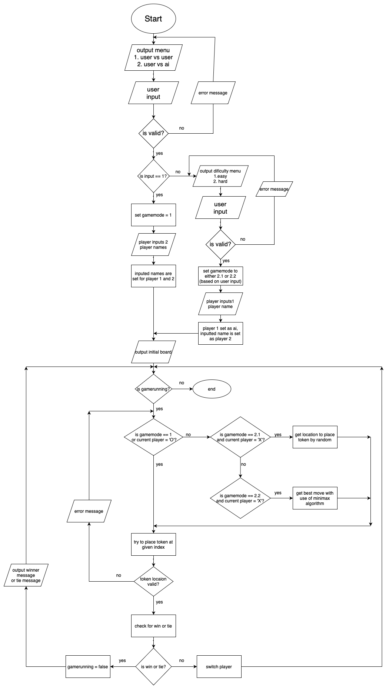

# Report
## A2 - Tic Tac Toe
### Julie Cortis and Julia Curmi

## Introduction
In this project two Tic-Tac-Toe games were implemented. One was done in Python using Functional Programming and one was done in Java using Object Oriented Programming (OOP). For this Tic-Tac-Toe game the user is first prompted to choose from a menu deciding between two game modes: User vs User and User vs AI. If User vs AI is selected, then the user is prompted to choose whether to play in Easy Mode (where the AI move is randomly generated) or Hard Mode (where the AI move is generated using the Minimax algorithm explained below).

## Functional Programming vs Object Oriented
In this project, the Functional Programming Paradigm was used in the Python code, whilst the Object Oriented Programming paradigm was implemented using Java. In Functional programming, all required operations are declared as different functions, which can then be called when needed without the need to create an object of the class. If a function is located in a different module then where it is needed you would simply need to import that module and call the function as “module.function()”. Using Functional programming has certain advantages such as easier reusability, modularity and easier testability as each function can be tested independently. However it also has its disadvantages such as readability, as it is harder to understand when and where some functions are used. Moreover, there may exist some performance issues as Python may take a bit more time to call functions when compared to inline code. In larger projects, this leads to namespace pollution as you have a lot of functions with different names which can become confusing.

## Error Handling

In the Python code there was no need to use the try-except block, since all inputs were either the player name (which had no restrictions on input types) or digits. The only means of input checking needed was for player input to place their token. Here, the string function “.isdigit()” was used to check if input is an integer. Additionally, inequality symbols were used to check if the input was in the correct range.

## Future Improvements
Some possible future improvements may include the implementation of a GUI in order to make the game more user friendly then it currently is, since it is terminal based. Another minor improvement can be that if the user enters a space for the player name then just player 1 or player 2 respectively is displayed instead of the space. Moreover, a possible future extension to the whole program would be a Tournament function, where a number of players (say 4 players) play against each other in 2v2 scenarios and the result of each game is stored. The players would then play against each other to determine a winner.

## Program Flowchart
